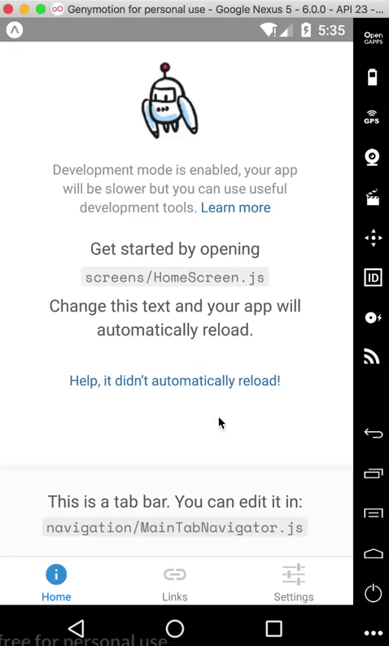

# React Native Android Backer



[中文文档](./README_cn.md)

## What

`React Native Android Backer` is a solution for React Native Android back button. It combines `react-navigation` API to provide powerful functionality, features as follow: 

* double click back button to exit app
* make back button disabled
* click back button to navigate page
* click back button to close modal

## Install

```sh
npm install react-native-android-backer
// 或
yarn add react-native-android-backer
```

## Dependency Library

Please make sure project have installed libraries as follow:

* react: >= 16.x
* react-native: >= 0.57.x
* react-navigation: >= 3.x

## Get Started

1. First step is to use `withBacker` function to encapsulation the `react-navigation` 的 `AppNavigator` component：

```js
import { withBacker } from 'react-native-android-backer';
import AppNavigator from './navigation/AppNavigator';

const AppNavigatorWithBacker = withBacker(AppNavigator, {
  exitToast: () => console.log('Click again will exit App'),
  isExitScreen: routeName => false,
});
```

`withBacker(component, options)`: this API is a [HOC](https://reactjs.org/docs/higher-order-components.html), it receive 2 params:

* component: type is React component, the wrap component
* options: type is object, use to config the back button behaviors，attributes as follow：
  * exitToast: type is function, the toast function for exit app
  * isExitScreen: type is function, check the current screen whether should exit app

`AppNavigatior` is the initialize file of use [`expo`](https://expo.io/) to create App project，the source file is here[这里](https://github.com/zhaozhiming/react-native-android-backer/blob/a9b594aba95616496cb22d9432c2c52eb58b9f61/example/navigation/AppNavigator.js)。

2. Second step is to replace `AppNavigator` to `AppNavigatorWithBacker`.

```diff
- <AppNavigator />
+ <AppNavigatorWithBacker />
```

## API

`React Native Android Backer` use the `react-navigation` [params](https://reactnavigation.org/docs/en/params.html) to do different things according to back button behaviors, params as follow:

* disableBack：type is boolean, set `true` to disable back button event.
* backPage && backPageParams： backPage's type is string，backPageParams's type is object, which were make back button to navigate to `backPage` with `backPageParams`.
* isModalShow && closeModal：isModalShow's type is function,  closeModal's type is function, which were make back button to close modal. 

使用示例：

```js
import React, { Component } from 'react';

class Foo extends Component {
  constructor(props) {
    ...
    // define the react-navigation params in the constructor 
    props.navigation.setParams({
      disableBack: true,
      backPage: 'Bar', // the page when click back button will navigate to
      backPageParams: { foo: 'foo' }, // the params in the navigate behave
      isModalShow: () => this.state.isVisible, // the funtion to check the modal whether to open
      closeModal: () => this.setState({ isVisible: false }), // the function to close the modal
    });
  }
  ...
}
```

## Extra API

`React Native Android Backer` also provide the extra API which is easy use the features of `react-navigation` but no need the `navigation` object: 

* navigate(page: string): navigate to some page
* goBack(): go back to latest page
* getCurrentRoute(): get the current page object

Example:

```js
import React, { Component } from 'react';
import { navigationServer } from 'react-native-android-backer';

class Foo extends Component {
  ...
  handleGoto = () => {
    navigationServer.navigate('Bar');
  }

  handleGoBack = () => {
    navigationServer.goBack();
  }

  getCurrentPage = () => {
    const currentPage = navigationServer.getCurrentRoute();
    // currentPage: {
    //   "key": "id-1552444588477-2",
    //   "params": {
    //     "disableBack": true,
    //   },
    //   "routeName": "Settings",
    // }
  }
  ...
}
```

## Demo

[Demo](./example)

## LICENSE

[Apache-2.0](./LICENSE)
